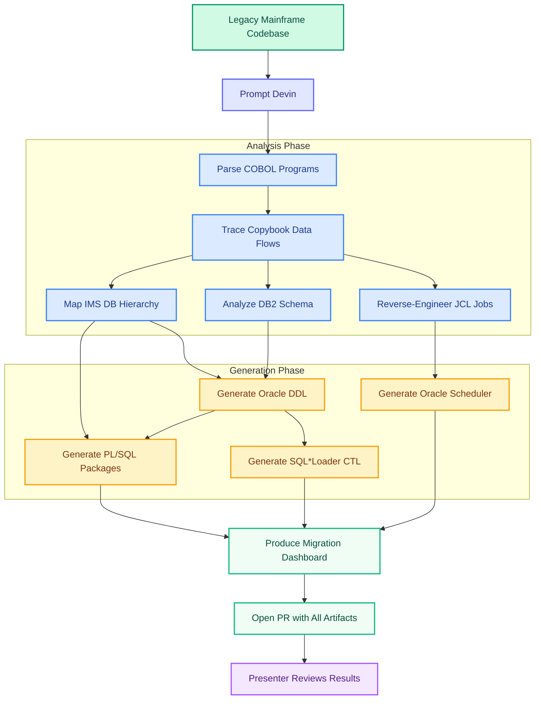
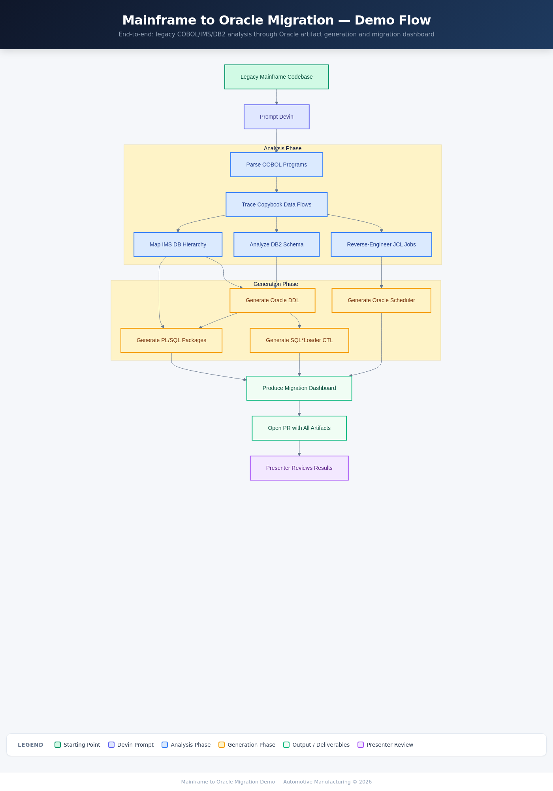

# Mainframe to Oracle Migration Demo — Automotive Manufacturing

> **Devin AI** analyzing and migrating legacy COBOL/IMS/DB2 mainframe batch systems to Oracle Database (PL/SQL, SQL\*Loader, Oracle Scheduler).
> All company names, data, and identifiers in this demo are fictional.

---



> Interactive version: [`docs/flowchart.html`](docs/flowchart.html)

<details>
<summary>PNG fallback</summary>


</details>

---

## What This Demo Shows

A large automotive manufacturer runs critical manufacturing systems — parts inventory, bill of materials, supplier EDI, quality control, and warranty claims — on IBM mainframes using COBOL, IMS, and DB2. With COBOL expertise retiring and mainframe costs rising, they need to migrate these batch workloads to Oracle Database. This demo shows Devin analyzing the entire legacy estate end-to-end and generating Oracle migration artifacts: DDL schemas, PL/SQL packages, SQL\*Loader control files, and Oracle Scheduler jobs.

## What Devin Does Live

In a single session, Devin reads every COBOL program, traces data flows through five shared copybooks, maps the IMS hierarchical database (PARTSEG → BOMSEG/QUALSEG, SUPPSEG), reverse-engineers three JCL job streams, and analyzes the DB2 schema. It then generates the complete Oracle target: table DDL with proper data type mapping (COMP-3 → NUMBER, PIC X → VARCHAR2), PL/SQL packages that replicate each batch program's business logic, SQL\*Loader control files for data migration, and Oracle Scheduler jobs that replace the JCL/Tidal orchestration. The audience sees the migration dashboard update in real time as artifacts are generated, showing program-by-program status, risk assessment, and IMS-to-Oracle mapping.

## Where Devin Provides Maximum Leverage

Devin's value in mainframe-to-Oracle migrations comes from three capabilities that directly address the hardest parts of the problem:

### 1. Codebase-Wide Analysis Before Action
COBOL data flows are invisible — a field at byte offset 79 in one copybook might be `QTY-ON-HAND` in `PARTMSTR.cpy` but `WS-FIELD-07` in another program. Devin maps the entire system before writing a single line of Oracle code: tracing every `COPY` statement, resolving every IMS SSA (Segment Search Argument), and connecting JCL DD names to the programs that read them. This system-wide map is what makes the migration accurate rather than piecemeal.

### 2. Batch Workload Migration (Restoring the Feedback Loop)
Batch programs — like the five in this repo — take structured inputs and produce deterministic outputs. Devin can recreate the logic in PL/SQL on its own VM and iterate until the outputs match the COBOL originals. This restores the feedback loop that mainframe code normally breaks for agents. Each program's business rules (weighted-average costing, BOM explosion with scrap factors, AQL acceptance sampling, warranty coverage calculations) are verified against known inputs/outputs.

### 3. Parallel Execution at Scale
Real mainframe estates have hundreds of programs. Devin runs hundreds of sessions concurrently — each migrating a program, each following the same playbook, each verifying against known outputs. What would take a team months happens in days.

## Cognition Case Studies

These are real engagements where Devin has delivered mainframe modernization at scale:

| Customer | Use Case | Result |
|---|---|---|
| [**Top 10 global automotive OEM**](https://www.cognition.ai/blog/how-devin-is-modernizing-cobol-at-fortune-500-companies) | Migrated 25,000-line COBOL customs workflow to AWS Lambda | **73% reduction in migration costs** |
| [**Itaú Unibanco**](https://www.cognition.ai/blog/how-devin-is-modernizing-cobol-at-fortune-500-companies) | Refactored corporate tax ID (numeric → alphanumeric) across entire COBOL estate | Completed **3 months ahead of government deadline**, 5–6x faster, zero production errors |
| [**Fortune 500 healthcare company**](https://www.cognition.ai/blog/how-devin-is-modernizing-cobol-at-fortune-500-companies) | Documented millions of lines of COBOL claims processing | Recovered institutional knowledge from retired engineers using DeepWiki + Devin |
| [**Mercedes-Benz**](https://www.cognition.ai/blog/engineering-in-the-fast-lane-mercedes-benz-partners-with-cognition) | Legacy modernization, cloud-native development, logistics | Deploying Devin and Windsurf across global engineering organization |

Source: [How Devin Is Modernizing COBOL at Fortune 500 Companies](https://www.cognition.ai/blog/how-devin-is-modernizing-cobol-at-fortune-500-companies) (April 2026)

## How the Demo Runs

The presenter opens a Devin session on this repo and prompts:

> *"Analyze the entire mainframe codebase — parse every COBOL program, trace all copybook data flows, map the IMS database hierarchy and JCL job dependencies, then generate the complete Oracle migration: DDL schemas, PL/SQL packages, SQL\*Loader control files, and Oracle Scheduler jobs. Update the migration dashboard as you go."*

Devin works through the analysis and generation phases shown in the flowchart above. The presenter narrates Devin's progress and opens the migration dashboard (`dashboard/index.html`) to show real-time status. At the end, Devin opens a PR containing all generated Oracle artifacts in the `oracle_target/` directory.

## Repo Layout

```
mainframe-oracle-migration-demo/
├── README.md                           ← You are here
├── DEMO_NOTES.md                       ← Presenter cheat sheet
├── docs/
│   ├── IMPLEMENTATION_PLAN.md          ← Detailed scaffold plan
│   ├── flowchart.html                  ← Interactive demo flow diagram
│   └── flowchart.png                   ← PNG fallback
│
├── mainframe_source/                   ── Legacy "before" state ──
│   ├── copybooks/                      5 shared data layouts (PARTMSTR, BOMREC, SUPPLIER, QUALREC, ERRCODES)
│   ├── programs/                       5 COBOL batch programs (~1,400 lines total)
│   ├── jcl/                            3 JCL job streams (PARTJOB, BOMJOB, NIGHTRUN)
│   ├── dbd/                            IMS database descriptor (MFGDB)
│   ├── psb/                            Program specification block (MFGPSB)
│   └── db2/                            DB2 table definitions (4 tables)
│
├── oracle_target/                      ── Empty scaffolding (Devin populates live) ──
│   ├── schema/                         Oracle DDL generated here
│   ├── packages/                       PL/SQL packages generated here
│   ├── loader/                         SQL*Loader CTL files generated here
│   └── scheduler/                      Oracle Scheduler jobs generated here
│
└── dashboard/
    ├── index.html                      Migration progress dashboard
    └── migration_state.json            Current migration state
```

## Key Concepts

| Term | Definition |
|---|---|
| **IMS DL/I** | IBM Information Management System — hierarchical database with segment-based access (GU, GHU, GNP, REPL, ISRT calls) |
| **Copybook** | Shared COBOL data layout (like a header file) defining record structures at fixed byte positions |
| **SSA** | Segment Search Argument — the "WHERE clause" of an IMS database call |
| **PCB** | Program Communication Block — handle for database or terminal access |
| **COMP-3** | Packed decimal storage — two digits per byte, sign in last nibble. Maps to Oracle NUMBER |
| **JCL** | Job Control Language — z/OS batch job orchestration (steps, datasets, condition codes) |
| **SQL\*Loader** | Oracle utility for bulk-loading flat files into database tables via CTL control files |
| **Oracle Scheduler** | DBMS_SCHEDULER — Oracle's built-in job scheduling (replaces JCL + Tidal) |
| **BOM Explosion** | Recursive traversal of parent → child part relationships to calculate material requirements |
| **AQL** | Acceptable Quality Level — sampling inspection standard per IATF 16949 |
| **EDI 850/856** | ANSI X12 electronic documents: 850 = Purchase Order, 856 = Advance Ship Notice |
| **IATF 16949** | Automotive quality management standard (extends ISO 9001 for auto supply chain) |
